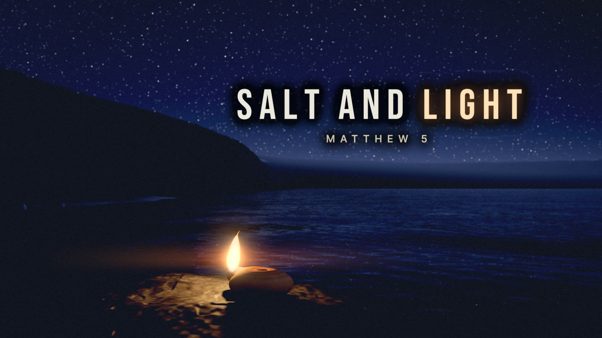

# Salt and Light

A song and code-rendered lyric film of Christ's Sermon on the Mount from Matthew 5: the Beatitudes, salt and light, the Law fulfilled, and the call to love enemies and be perfect as the Father in heaven is perfect.

Built with the Ark engine: https://github.com/omiron33/ark-video-studio



[Listen at TechnoChristianity](https://technochristianity.com/music) · [More films on YouTube](https://www.youtube.com/@technochristianity)

The film runs **5:07** at **1920 × 1080 / 60 fps**. Every frame of its 53 scenes is drawn in code on the GPU: the Sea of Galilee at night, a hilltop town of lamplit windows, salt crystals, a Torah scroll, embers, a temple altar, roads and fires before dawn, and sunrise over the mount, with typography set to the sung onset of each word. Nothing in the picture is a photograph, a downloaded model or a generated image.

The film passes through one night on the hills above the sea and ends at sunrise. Each Beatitude is a dark, quiet place given one small light. The choruses return to salt and lamplight, the Law is stone and lamplight, the hard teachings come in the grey-blue before dawn, and "Be perfect" is the mount filled with morning light. People appear only as cast shadows; Christ is the voice and the light, never a figure.

## Quick start

Install Node.js 22 or later, Google Chrome and FFmpeg (`ffmpeg` and `ffprobe` on your PATH), then:

```sh
npm ci
npm run validate
npm run still -- --scene s00-title --time 9.5 --samples 2
```

The still appears in `out/portable/stills/` (the picture, and the picture with its words as `-full.png`). No recording is needed for stills or scene clips. Set the `CHROME` environment variable if Chrome is installed outside the platform's usual location.

For the complete film, place the original 48 kHz stereo recording at `media/song.wav` and run:

```sh
npm run render -- --draft
npm run render
```

Full rendering is GPU intensive and takes hours. The draft uses 30 fps and two samples; the final uses 60 fps, 10 picture samples and 8 lyric samples. Scenes are rendered one at a time and completed outputs are cached. See [rendering](docs/RENDERING.md) for scene clips, requirements and limitations.

## Source layout

- `film.json`: scene order and timings (53 scenes, cut on measured beats).
- `scenes/`: one picture module and one lyric module per scene.
- `lib/`: the film's worlds (Galilee by night and at dawn, the town, the house and its lamp, salt, the scroll, the temple, embers, the heart, roads and the vigil lamp), the shared look and the typography.
- `data/`: aligned sung words and lines, and measured musical timing.
- `fonts/`: Bebas Neue, the capitals for the words that carry each line.
- `renderer/`: deterministic browser rendering and local FFmpeg encoding.
- `tools/`: rendering, validation and the optional planning and timing utilities.
- `intake/sung-lyrics.txt`: the sung lyric text.

[Visual brief](docs/BRIEF.md) · [Storyboard](docs/STORYBOARD.md) · [Scene architecture](docs/AUTHORING.md) · [Credits and licenses](docs/CREDITS.md)

## License

Source code is released under the [MIT License](LICENSE). Fonts retain their SIL Open Font License notices. The Hebrew text on the scroll is from Sefaria under CC BY-SA 4.0 (see [credits](docs/CREDITS.md)). The song recording and the finished film are separate media releases; the source-code license does not grant any rights to the recording, its lyrics as a recorded work, or the rendered film.
